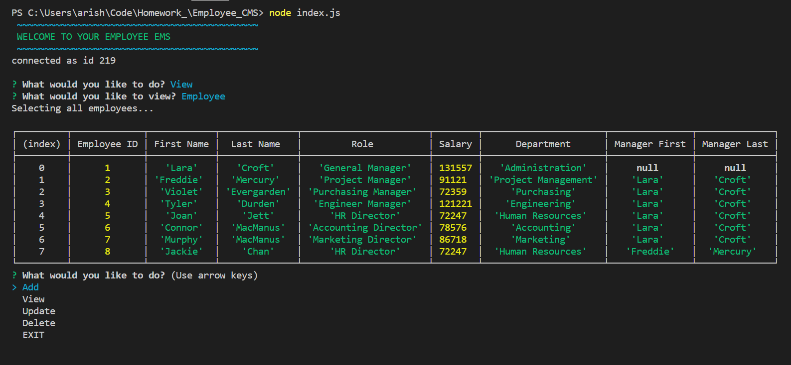

# Employee_CMS
This app creates an employee CMS, Cmployee Management System, interface to view and interact with information stored in an employee database. This app uses node.js, inquirer, and MySQL to interface information from the command line to be able to create, read, update, and delete information from a database.



## Business Need:
```
As a business owner
I want to be able to view and manage the departments, roles, and employees in my company
So that I can organize and plan my business
```

## Functionality
Once setup, the user can easily run the application by selecting options and answering questions displayed in the command line. These prompts allow them to do all of the following actions:

  * Add departments, roles, employees

  * View departments, roles, employees, employees by manager, and payroll budget by department

  * Update employee roles, employee managers

  * Delete departments, roles, and employees

## Requirements
  1. mySQL workbench
  2. most CL Terminals should work. A list can be found at https://www.npmjs.com/package/inquirer#support under the heading "Support (OS Terminals)"

## Setup
  1. Clone repository from github
  2. Open a command prompt terminal and enter the following commands after navigating to the folder where you want the program to live:
    * git clone git@github.com:ajrsabet/Employee_CMS.git
    * npm install
  3. UPDATE index.js with your mySQL password

## Run
  1. Open a command prompt terminal and navigating to the folder where you have installed this repository:
    * node index.js
  2. Navigate the program by following the prompts
  3. On initial setup:
    * Input options will be limited to control dependencies. You will first be prompted to add a department before you will be able to do anything else. Once you have at least one department, role, and employee then all options will be available to you.

  ```
  Note: Employees are dependent on roles and roles are dependent on departments so you cannot delete a role/department without removing/changing the dependents (e.g. if Ted Baker (employee) is listed as an accountant (role) in Finance (department) then you cannot delete this role or department without transfering Ted to another possition.)
  ```